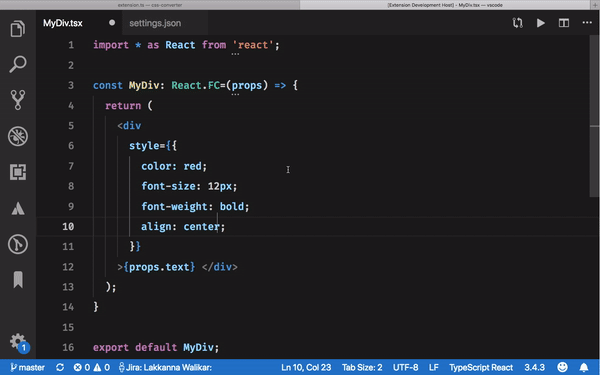

# CSS Converter

VS Code extension to convert a kebab-case css to camel case css or vice-versa.

### If you like 👍 give stars ⭐️ in [Github](https://github.com/Lakkanna/css-converter) and [VS Code Marketplace](https://marketplace.visualstudio.com/items?itemName=Lakkannawalikar.css-converter&ssr=false#review-details).

### **Set this configuration in settings.json to indentation works**
  `"javascript.format.insertSpaceBeforeAndAfterBinaryOperators": false,`
  
  `"typescript.format.insertSpaceBeforeAndAfterBinaryOperators": false,`

  **Auto Format is default on, to turn off auto format add configuration in settings.json**
  
  `cssConverter.autoFormat: false`

## How to use
  1. Select the CSS text you want convert
  2. Open  `Command Pallette (Shift + Command + P) / (Shift + Control + P)` in VS-Code and enter `CSS Converter`
  3. Select `CSS Converter` from searched result
  4. **How's the josh** your css is converted.

## Example
  ### **kebab-case to camelCase**
    background-color: #FFF;   ===>   backgroundColor: "#FFF",

  ### **camelCase to kebab-case**
    backgroundColor: "#FFF",   ===>   background-color: #FFF;

## Features

* Convert your html css to jsStyle which support in react style elements.

* Auto identifies CSS style format.

## Known Issues

* Additional space after value # (example: backgroundColor: "#FFF",  ===>  background-color: # FFF;)

## Release Notes

### 0.0.7
* Added configuration for format, default value will be true, to turn off auto format add `cssConverter.autoFormat: false` in **settings.json**

### 0.0.6
* fixed camelCase CSS string with comma separated values issue

### 0.0.5
* Fixed format should apply only for selected range

### 0.0.4
* Fixed auto indentaion issue
* Fixed Additional double quotes if try to convert kebab-case css to camelCase

### 0.0.3
* Added black background how to use gif in readme

### 0.0.2
* Added how to use gif in readme

### 0.0.1
**Initial release of CSS Converter** 
> Identifies format of css and converts it to kebab-case or camelCase based on which css format we selected.

-----------------------------------------------------------------------------------------------------------

**Enjoy!**
